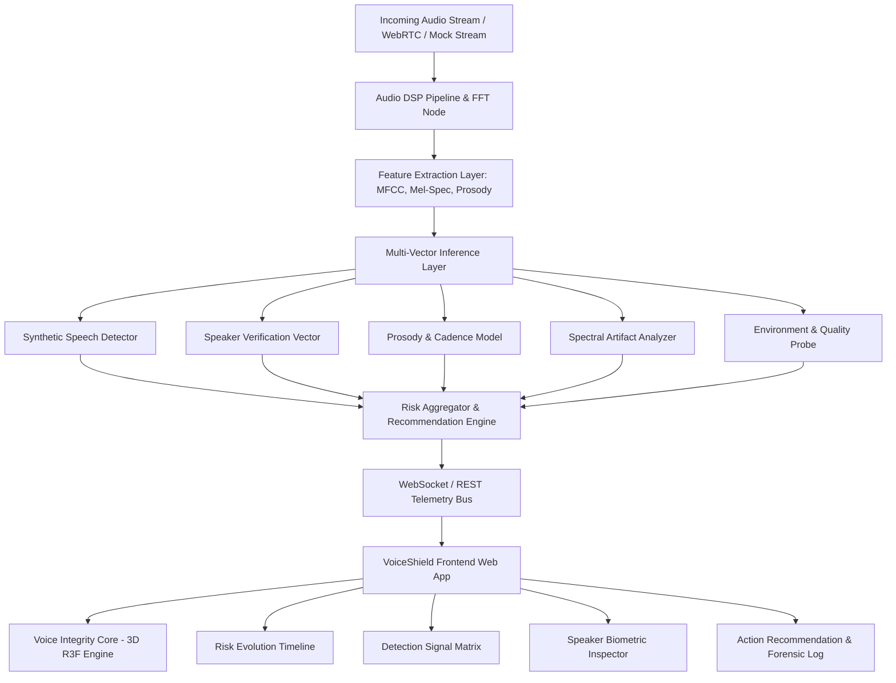

# VoiceShield System Architecture & Frontend Blueprint

---

## 1. System High-Level Topology



---

## 2. Frontend Layered Architecture

```
src/
├── assets/             # Brand SVGs, static textures, audio test samples
├── components/
│   ├── common/         # Atomic UI: Badges, Buttons, Indicators, Tooltips, Cards
│   ├── core3d/         # 3D Voice Integrity Core (Three.js, R3F, Shaders, Geometries)
│   ├── layout/         # Header, Navigation, Top Status Bar, Sidebar, Shell
│   ├── matrix/         # Detection Signal Matrix, Vector Gauges, Telemetry Sparklines
│   ├── timeline/       # Risk Timeline (Live Evolving Time-Series Chart)
│   ├── speaker/        # Speaker Verification, Biometric Drift, Reference Audio Comparison
│   ├── recommendations/# Action Recommendation Engine & Security Workflow Triggers
│   ├── events/         # Chronological Security Event Stream & Forensic Log
│   └── modals/         # Forensic Deep Dive, Session Export, Policy Config Modals
├── pages/
│   ├── Dashboard.tsx   # Main Voice Integrity Center (Primary Operational Screen)
│   ├── CallAnalysis.tsx# Forensic Audio & Deep Spectral Waveform Studio
│   ├── History.tsx     # Historical Incident Logs & Session Reports
│   └── Settings.tsx    # Neural Thresholds, WebRTC Configuration & Privacy Controls
├── hooks/
│   ├── useVoiceStream.ts  # Audio streaming hook (Web Audio API + DSP simulation)
│   ├── useRiskTelemetry.ts# Real-time WebSocket/Mock Telemetry feed
│   └── useScenarioRunner.ts # Multi-scenario simulation engine for live hackathon demos
├── services/
│   ├── api.ts          # REST API client abstraction (Axios/Fetch with retry)
│   ├── websocket.ts    # WebSocket client with auto-reconnection and heartbeat
│   └── audioEngine.ts  # Web Audio API context, AnalyzerNode, synthetic audio generator
├── data/
│   ├── mockSessions.ts # Realistic session datasets (Low Risk, Clone Attack, Replay, etc.)
│   ├── scenarios.ts    # SIH live evaluation interactive scenarios
│   └── threatIntel.ts  # Voice synthetic attack taxonomy and signatures
├── types/
│   ├── telemetry.ts    # TypeScript definitions for risk, signals, metrics, sessions
│   ├── audio.ts        # Audio buffer, FFT bins, frequency band structures
│   └── navigation.ts   # Route definitions and navigation states
└── lib/
    ├── math.ts         # Interpolation, exponential smoothing, audio normalization
    ├── formatters.ts   # Monospace timestamps, byte size, decibel formatters
    └── theme.ts        # CSS variable tokens and color constants
```

---

## 3. Communication Contract (WebSocket & REST API Protocol)

### 3.1 WebSocket Telemetry Message Structure
```typescript
interface VoiceShieldTelemetryPacket {
  sessionId: string;
  timestamp: string; // ISO 8601 UTC
  frameIndex: number;
  overallRiskScore: number; // 0.0 to 100.0
  riskClassification: 'LOW' | 'MEDIUM' | 'HIGH' | 'CRITICAL';
  analysisState: 'STREAMING' | 'ANALYZING' | 'HOLD' | 'TERMINATED';
  confidence: number;
  vectors: {
    syntheticSpeech: SignalVectorMetric;
    speakerConsistency: SignalVectorMetric;
    prosodyNaturalness: SignalVectorMetric;
    spectralArtifacts: SignalVectorMetric;
    audioQuality: SignalVectorMetric;
  };
  speakerVerification: {
    referenceAvailable: boolean;
    referenceSpeakerId?: string;
    referenceSpeakerName?: string;
    similarityScore: number; // 0.0 to 100.0
    verificationStatus: 'VERIFIED' | 'AMBIGUOUS' | 'MISMATCH' | 'UNENROLLED';
    biometricDrift: number;
  };
  recommendation: {
    level: 'ALLOW' | 'MONITOR' | 'CHALLENGE' | 'RESTRICT' | 'TERMINATE';
    headline: string;
    details: string;
    recommendedActions: string[];
  };
  audioMetrics: {
    snrDb: number;
    sampleRate: number;
    codec: string;
    latencyMs: number;
    frequencySpectrum: number[]; // 32 normalized FFT bands for 3D core
  };
}
```
